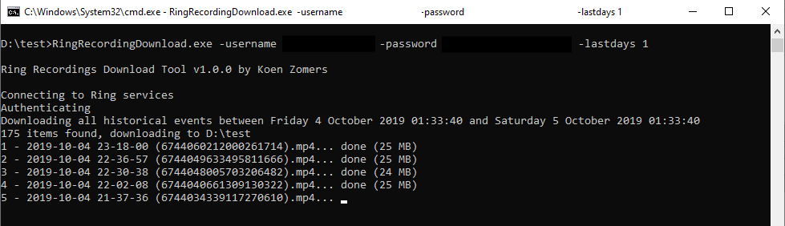
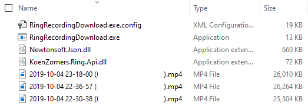

[![licence badge]][licence]
[![stars badge]][stars]
[![forks badge]][forks]
[![issues badge]][issues]

[licence badge]:https://img.shields.io/badge/license-Apache2-blue.svg
[stars badge]:https://img.shields.io/github/stars/koenzomers/RingRecordingDownload.svg
[forks badge]:https://img.shields.io/github/forks/koenzomers/RingRecordingDownload.svg
[issues badge]:https://img.shields.io/github/issues/koenzomers/RingRecordingDownload.svg

[licence]:https://github.com/koenzomers/RingRecordingDownload/blob/master/LICENSE.md
[stars]:https://github.com/koenzomers/RingRecordingDownload/stargazers
[forks]:https://github.com/koenzomers/RingRecordingDownload/network
[issues]:https://github.com/koenzomers/RingRecordingDownload/issues

# Ring Recording Download Tool
Console application written in .NET Framework 4.6.2 which allows for downloading of Ring recorded events to your local machine. It is just a sample console application wrapper around the [Ring API I have written](https://github.com/KoenZomers/RingApi).

## Version History

1.0 - October 5, 2019

- Initial version

## System Requirements

- Windows machine
- Microsoft .NET Framework 4.6.2

## Usage Instructions

1. Download the ZIP file of the latest version from [releases](https://github.com/KoenZomers/RingRecordingDownload/releases)
2. Extract it to any location on your machine
3. Run RingRecordingDownload.exe in a Command Prompt or PowerShell window to see the possible parameters and samples

## Current functionality

With this tool in its current state you can:

- Download all recordings of the last X days
- Download all recordings between two specific data/times
- Download all recordings of a specific type, i.e. ring or motion

## Feedback

Any kind of feedback is welcome! Feel free to drop me an e-mail at koen@zomers.eu or [create an issue](https://github.com/KoenZomers/RingRecordingDownload/issues).
