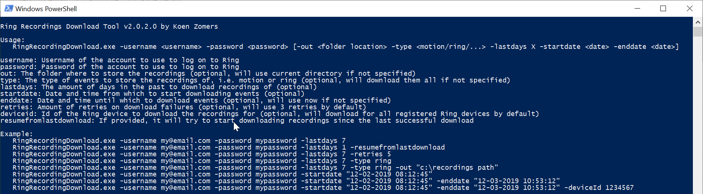

[![licence badge]][licence]
[![issues badge]][issues]
[![downloads badge]][downloads]

[![prwelcome badge]][prwelcome]

[licence badge]:https://img.shields.io/badge/license-Apache2-blue.svg
[issues badge]:https://img.shields.io/github/issues/koenzomers/RingRecordingDownload.svg
[downloads badge]:https://img.shields.io/github/downloads/koenzomers/RingRecordingDownload/total.svg
[prwelcome badge]:https://img.shields.io/badge/PRs-welcome-brightgreen.svg?style=flat-square

[licence]:https://github.com/koenzomers/RingRecordingDownload/blob/master/LICENSE.md
[issues]:https://github.com/koenzomers/RingRecordingDownload/issues
[downloads]:https://github.com/koenzomers/RingRecordingDownload/releases
[prwelcome]:http://makeapullrequest.com

# Ring Recording Download Tool
Console application written in .NET 6 compiled for Windows, Raspberry Pi, Linux and macOS which allows for downloading of Ring recorded events to your local machine.

## Version History

[4.0.0.0](https://github.com/KoenZomers/RingRecordingDownload/releases/tag/4.0.0.0) - Aug, 07, 2024

- Fixes Session bug that causes the access and refresh token to expire before it should.

[3.2.0.0](https://github.com/KoenZomers/RingRecordingDownload/releases/tag/3.2.0.0) - July 26, 2024

- Fixes Token Expiration logic that throws session errors after the token expires.

[3.1.1.0](https://github.com/KoenZomers/RingRecordingDownload/releases/tag/3.1.1.0) - April 7, 2024

- Fixed typo in console application

[3.1.0.0](https://github.com/KoenZomers/RingRecordingDownload/releases/tag/3.1.0.0) - April 6, 2024

- Fixed login and refresh session issue, ring was returning 406 due to headers missing

[3.0.0.0](https://github.com/KoenZomers/RingRecordingDownload/releases/tag/3.0.0.0) - September 3, 2023

- Completely removed the dependance on the Ring API package. Only kept a bare minimum version of the model inside this application to avoid conflicts and parsing issues as much as possible.

[2.3.0.0](https://github.com/KoenZomers/RingRecordingDownload/releases/tag/2.3.0.0) - September 2, 2023

- Upgraded to [Ring API v0.5.3.0](https://github.com/KoenZomers/RingApi#version-history) which fixes some parsing issues

[2.2.0.0](https://github.com/KoenZomers/RingRecordingDownload/releases/tag/2.2.0.0) - July 4, 2023

- Upgraded to [Ring API v0.5.2.0](https://github.com/KoenZomers/RingApi#version-history) which fixes the login issue

[2.1.0.1](https://github.com/KoenZomers/RingRecordingDownload/releases/tag/2.1.0.0) - September 14, 2022

- Upgraded to [Ring API v0.5.0.1](https://github.com/KoenZomers/RingApi#version-history)

[2.1.0.0](https://github.com/KoenZomers/RingRecordingDownload/releases/tag/2.1.0.0) - September 14, 2022

- Upgraded to [Ring API v0.5.0.0](https://github.com/KoenZomers/RingApi#version-history)

[2.0.5.0](https://github.com/KoenZomers/RingRecordingDownload/releases/tag/2.0.5.0) - September 14, 2022

- The tool is now compiled against .NET 6 for [future supportability](https://dotnet.microsoft.com/en-us/platform/support/policy/dotnet-core#lifecycle)

[2.0.4.0](https://github.com/KoenZomers/RingRecordingDownload/releases/tag/2.0.4.0) - September 14, 2022

- Added `-list` option to show the available Ring devices with their deviceid

[2.0.3.1](https://github.com/KoenZomers/RingRecordingDownload/releases/tag/2.0.3.1) - February 3, 2021

- Added extra error handling around downloading the recordings

[2.0.3.0](https://github.com/KoenZomers/RingRecordingDownload/releases/tag/2.0.3.0) - February 2, 2021

- Added -ignorecachedtoken argument to prevent the cached token from being used so i.e. you can authenticate to another Ring device [issue #10](https://github.com/KoenZomers/RingRecordingDownload/issues/10)

[2.0.2.1](https://github.com/KoenZomers/RingRecordingDownload/releases/tag/2.0.2.1) - April 29, 2020

- Updated [Ring API](https://github.com/KoenZomers/RingApi) to [0.4.3.2](https://www.nuget.org/packages/KoenZomers.Ring.Api/0.4.3.2) which fixes a bug which could occasionally throw a NullReferenceException while retrieving the recorded items
- Minor modification to the async processing of results

[2.0.2.0](https://github.com/KoenZomers/RingRecordingDownload/releases/tag/2.0.2.0) - March 18, 2020

- Updated [Ring API](https://github.com/KoenZomers/RingApi) to [0.4.3.1](https://www.nuget.org/packages/KoenZomers.Ring.Api/0.4.3.1)
- Added `-deviceid` option which you can specify to only download recordings for a specific Ring device
- Added `-resumefromlastdownload` option which will keep track of the most recent successfully downloaded recording and on subsequent runs will only download recordings up to this one (all recordings are downloaded in the order of most recent to least recent) so you can run this multiple times during the day without having to download the same recordings again

[2.0.1.1](https://github.com/KoenZomers/RingRecordingDownload/releases/tag/2.0.1.1) - March 12, 2020

- Added clarification in the help that you need to wrap space containing arguments such as dates or output paths in single or double quotes [issue #8](https://github.com/KoenZomers/RingRecordingDownload/issues/8)

[2.0.1.0](https://github.com/KoenZomers/RingRecordingDownload/releases/tag/2.0.1.0) - February 25, 2020

- Rewritten the application to handle asynchronous requests better
- Added more exception handling around the authentication
- Fixed an issue where two factor authentication would not work [issue #6](https://github.com/KoenZomers/RingRecordingDownload/issues/6)

2.0.0.0 - February 13, 2020

- Application has been recompiled in .NET Core so it runs on Windows, Linux, Raspberry Pi and macOS devices without any dependencies on OS components

1.1.1.0 - February 12, 2020

- Fixed an issue where it would throw a NullReferenceException after authentication. Thanks to Andre for reporting this!

1.1.0.1 - January 22, 2020

- Upgraded the [Ring API package](https://github.com/KoenZomers/RingApi) to [version 0.4.2.1](https://www.nuget.org/packages/KoenZomers.Ring.Api/0.4.2.1) which fixes an issue retrieving the doorbot history which this tool could run into as well

1.1.0.0 - December 24, 2019

- Ring changed their download API which caused this tool to fail on some recording downloads. Updated the code so that it downloads the recordings properly.
- Added support for using Ring accounts with two factor authentication enabled. If the account you wish to use uses two factor authentication, run the tool manually the first time. It will trigger a text message to be sent to you and ask for it in the console application. Once you've entered the token received in the text message on your phone, it will store the refresh token in the application configuration file so on subsequent runs you don't need to enter it anymore and can run the application unattended in i.e. a daily script. Also for Ring accounts without two factor authentication, you don't have to store the credentials in the config file anymore or provide them on every run as it will utilize the refresh token from the first run to authenticate.
- Upgraded the [Ring API package](https://github.com/KoenZomers/RingApi) to [version 0.4.1.0](https://www.nuget.org/packages/KoenZomers.Ring.Api/0.4.1)

1.0.2.0 - October 27, 2019

- Upgraded the Ring API package to version 0.3.5.0 which ensures the session with the Ring service is still active. This should resolve the 401 Unauthorized errors which occur after one hour of downloading recordings.

1.0.1.0 - October 27, 2019

- Added retry option based on feedback received. The Ring service randomly gives out 404 File Not Found errors. When you just retry it a couple of times it will work. By default it will retry three times now. You can increase this number by providing the -retries flag.
- If an error is returned by the Ring service, the error shown in the console output will now also show the actual error returned by Ring, if available

1.0.0.0 - October 5, 2019

- Initial version

## System Requirements

- Either of: Windows x86, Windows x64, Windows ARM (i.e. Windows 10 IoT), Linux ARM (i.e. Raspberry Pi), Linux x64 (any Linux based distribution), Mac OS (Apple devices)
- For all platforms the application is self containing, so it does not need anything else to be installed on the operating system, not even .NET Core

## Usage Instructions

1. Download the ZIP file of the latest version from [releases](https://github.com/KoenZomers/RingRecordingDownload/releases). Make sure you download the right type for the platform on which you want to run it:
   - Windows 7 SP1 or later, Windows 8.1, Windows 10 version 1607 or later, Windows 11, Windows Server 2012 R2 or later: win-x64.zip (64 bit) or win-x86.zip (32 bit)
   - Linux ARM (i.e. Raspberry Pi): linux-arm.zip (32 bit) or linux-arm64.zip (64 bit)
   - Linux x64 (any Linux based distribution): linux-x64.zip
   - Mac OSX (Apple devices): osx-x64.zip or osx-arm64.zip
2. Extract it to any location on your machine
3. Run RingRecordingDownload to see the possible parameters and samples

If you want to run this application unattended in i.e. a scheduled daily download script, ensure you run it once manually with your username and password. After this run it will store the refresh token and will run without needing a username, password or two factor authentication token on subsequent runs.

## Current functionality

With this tool in its current state you can:

- Log on once to a two factor authentication enabled Ring account and then have it use the retrieved refresh token to run unattended on subsequent runs
- Download all recordings of the last X days
- Download all recordings between two specific data/times
- Download all recordings of a specific type, i.e. ring or motion
- Download all recordings from a specific Ring device
- Download all recordings since you've last downloaded them

## Feedback

Any kind of feedback is welcome! Feel free to drop me an e-mail at koen@zomers.eu or [create an issue](https://github.com/KoenZomers/RingRecordingDownload/issues).
